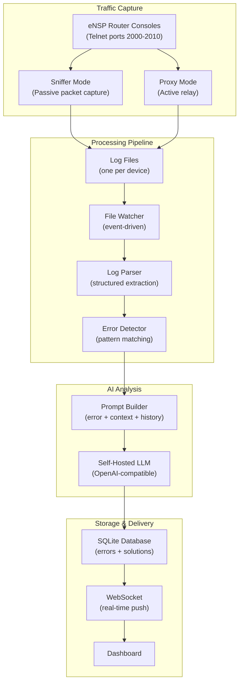

# System Architecture Diagram

## Component Overview

| Component | Description |
|-----------|-------------|
| Traffic Capture | Sniffer or Proxy mode to capture CLI traffic |
| Log Files | One log file per device/port |
| File Watcher | Event-driven monitoring |
| Log Parser | Extracts structured data from log lines |
| Error Detector | Pattern matching for errors |
| AI Analyzer | LLM-based root cause analysis |
| Database | SQLite storage |
| WebSocket | Real-time push to dashboard |
