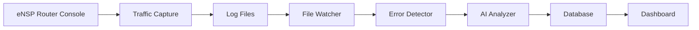

# Overview

AIDEN Labs monitors your Huawei eNSP network simulator in real time. When you type commands into an eNSP router console, the system:

- **Captures** every command you send and every response the router sends back
- **Watches** the captured logs for errors
- **Detects** known error patterns (like Error: Unrecognized command)
- **Analyzes** each error with AI to explain the root cause and provide a fix
- **Persists** the error and the AI-generated solution in a database
- **Notifies** your dashboard in real time via WebSocket

## System Flow

## Key Features

- **Real-time Monitoring**: Event-driven file watching with millisecond response time
- **AI-Powered Analysis**: Self-hosted LLM for root cause analysis and solutions
- **Pattern Detection**: Detects critical errors and warnings automatically
- **Deduplication**: TTL-based deduplication prevents alert flooding
- **WebSocket Notifications**: Real-time dashboard updates
- **Dual Capture Modes**: Sniffer Mode (passive) or Proxy Mode (active)

## Getting Started

See the [Startup Sequence](/docs/startup) guide to learn how to configure and run the system.
