# AIDEN Labs — ENSP Logger System Documentation

> How the system captures eNSP CLI traffic, detects errors, analyzes them with AI, and stores everything for you.

---

## Overview

AIDEN Labs monitors your Huawei eNSP network simulator in real time. When you type commands into an eNSP router console, the system:

1. **Captures** every command you send and every response the router sends back
2. **Watches** the captured logs for errors
3. **Detects** known error patterns (like `Error: Unrecognized command`)
4. **Analyzes** each error with AI to explain the root cause and provide a fix
5. **Persists** the error and the AI-generated solution in a database
6. **Notifies** your dashboard in real time via WebSocket


---

## Step 1 — Capturing CLI Traffic

The system needs to see everything happening in your eNSP console sessions. It supports two capture modes:

### Sniffer Mode (Passive)

This is the default mode on Windows. The system uses a network packet sniffer to **passively listen** on the loopback network adapter (the internal network that eNSP uses to communicate between your PC and the simulated routers).

**How it works:**

- eNSP routers expose their CLI over Telnet on specific ports (e.g., ports 2000–2010)
- The sniffer listens on the loopback adapter and filters for TCP traffic on those ports
- Every packet is captured, and the system determines the direction:
  - **Outgoing (→)**: commands you type into the console
  - **Incoming (←)**: responses the router sends back
- The system can **auto-detect** new console ports as they appear — you don't need to manually configure every port

**Key details:**

- You connect to eNSP as you normally would; the sniffer is invisible to you
- Duplicate packets (a quirk of Windows loopback capture) are automatically filtered out
- The sniffer handles Telnet protocol noise (control sequences, negotiation bytes) and strips them away, leaving only clean, readable text

### Proxy Mode (Active)

An alternative capture method. Instead of passively sniffing, the system acts as a **middleman** between your Telnet client and eNSP.

**How it works:**

- The proxy listens on offset ports (e.g., 3000–3004)
- You connect your Telnet client to the proxy port (e.g., 3000) instead of directly to eNSP (e.g., 2000)
- The proxy forwards everything transparently between you and eNSP, logging all traffic in both directions

**When to use each mode:**

| Mode | Advantage | Requirement |
|------|-----------|-------------|
| **Sniffer** | No config changes needed — completely invisible | Admin privileges, Npcap installed |
| **Proxy** | Works without admin/Npcap, captures 100% of data | Must change your Telnet connection port |

---

## Step 2 — Writing Log Files

Regardless of which capture mode is used, all traffic is written to **log files** on disk. Each device/port gets its own log file, named with the device hostname and a timestamp (e.g., `Router1_2000_20260227_080000.log`).

Each line in the log file follows this format:

```
[2026-02-27 08:00:01] [Router1] → 'display ip interface brief'
[2026-02-27 08:00:01] [Router1] ← 'Interface         IP Address      ...'
[2026-02-27 08:00:02] [Router1] ← '<Router1>'
```

- `→` = commands you typed
- `←` = responses from the router
- The device name (e.g., `Router1`) is automatically detected from router prompts like `<Router1>` or `[Router1]`

**Before writing, the system cleans up the raw data:**

- Strips Telnet control sequences (the behind-the-scenes protocol negotiation)
- Removes ANSI escape codes (color/formatting from terminal emulators)
- Handles backspace characters (so corrected typos look clean in the log)
- Reconstructs error messages that arrive split across multiple packets
- Suppresses echoed commands and duplicate prompt lines

---

## Step 3 — Watching for Changes

A **file watcher** continuously monitors the log directory. The moment a log file is created or modified, the watcher:

1. Detects the change
2. Reads only the **new content** that was just appended (it tracks how much it has already read)
3. Passes the new content to the error detection pipeline

This is event-driven — there's no polling delay. Changes are picked up within milliseconds.

---

## Step 4 — Detecting Errors

The new log content is sent through two processing stages:

### Parsing

The log parser reads each line and extracts structured information:

- **Timestamp** — when the line was logged
- **Device ID** — which router/switch produced it
- **Direction** — whether it's a command (`→`) or a response (`←`)
- **Content** — the actual text

### Pattern Matching

The error detector checks each line against two sets of known patterns:

**Critical patterns** — serious errors that typically need immediate attention:

- `Error:` messages (e.g., `Error: Unrecognized command`)
- Interface errors (`down`, `error-down`)
- Protocol failures (OSPF neighbor errors, BGP session drops)

**Warning patterns** — less severe issues worth noting:

- Duplicate IP addresses
- Timeout messages
- Configuration conflicts

The system also has **TTL-based deduplication** — if the same error appears again within 5 minutes, it's not flagged again. This prevents you from being flooded with repeated alerts for the same issue.

---

## Step 5 — AI Analysis

When an error is detected, it's sent to an AI language model for analysis. The system builds a detailed prompt that includes:

- The **device name** and **timestamp**
- The **error line** itself
- **Surrounding context** — the 30 lines before and after the error for full visibility
- **Recent command history** — what commands were typed leading up to the error

The AI responds with a structured analysis:

| Section | What it answers |
|---------|------|
| **Root Cause** | What specifically caused this error |
| **Impact** | What services or interfaces are affected |
| **Solution** | Exact VRP commands to fix the issue |
| **Prevention** | Best practices to avoid it in the future |

The AI service connects to a self-hosted LLM server (compatible with the OpenAI API format), so no data leaves your network.

---

## Step 6 — Persisting to the Database

Both the error and the AI solution are saved to a local SQLite database:

**Errors table** stores:
- Device ID, timestamp, severity
- The error line and surrounding context
- Which pattern triggered the detection

**Solutions table** stores:
- Root cause, impact, solution, and prevention
- Linked back to the specific error

You can query errors by device, severity, or time range.  
You can also dismiss errors from the dashboard once you've addressed them.

---

## Step 7 — Real-Time Dashboard Notification

The moment an error is analyzed and stored, the system broadcasts it over a **WebSocket connection** to all connected dashboard clients.

This means:

- The error and its AI-generated solution appear on your dashboard **immediately** — no page refresh needed
- Multiple users can watch the same dashboard simultaneously
- If the WebSocket disconnects, the frontend falls back to periodic polling so you never miss an error

---

## System Architecture Diagram

```mermaid
flowchart TB
    subgraph Capture["🔌 Traffic Capture"]
        direction TB
        ENSP["eNSP Router Consoles<br/>(Telnet ports 2000-2010)"]
        SNIFF["Sniffer Mode<br/>(Passive packet capture)"]
        PROXY["Proxy Mode<br/>(Active relay)"]
        ENSP --> SNIFF
        ENSP --> PROXY
    end

    subgraph Processing["⚙️ Processing Pipeline"]
        direction TB
        LOGFILE["Log Files<br/>(one per device)"]
        WATCH["File Watcher<br/>(event-driven)"]
        PARSE["Log Parser<br/>(structured extraction)"]
        DETECT["Error Detector<br/>(pattern matching)"]
    end

    subgraph Analysis["🤖 AI Analysis"]
        direction TB
        LLM["Self-Hosted LLM<br/>(OpenAI-compatible)"]
        PROMPT["Prompt Builder<br/>(error + context + history)"]
    end

    subgraph Storage["💾 Storage & Delivery"]
        direction TB
        DB["SQLite Database<br/>(errors + solutions)"]
        WS["WebSocket<br/>(real-time push)"]
        DASH["Dashboard"]
    end

    SNIFF --> LOGFILE
    PROXY --> LOGFILE
    LOGFILE --> WATCH
    WATCH --> PARSE
    PARSE --> DETECT
    DETECT --> PROMPT
    PROMPT --> LLM
    LLM --> DB
    DB --> WS
    WS --> DASH
```



---

## Startup Sequence

When the AIDEN Labs backend starts, it automatically:

1. Connects to the database (creates it if it doesn't exist)
2. Configures the AI/LLM service
3. Starts the traffic capture (sniffer or proxy, based on settings)
4. Begins watching the log directory for changes
5. Registers the error analyzer to receive new log content
6. Opens the WebSocket for dashboard connections

When it shuts down, it:

1. Stops the capture service
2. Stops the file watcher
3. Cleans up old log files
4. Closes the database connection

Everything is automated — once the backend is running, the full pipeline is active.
